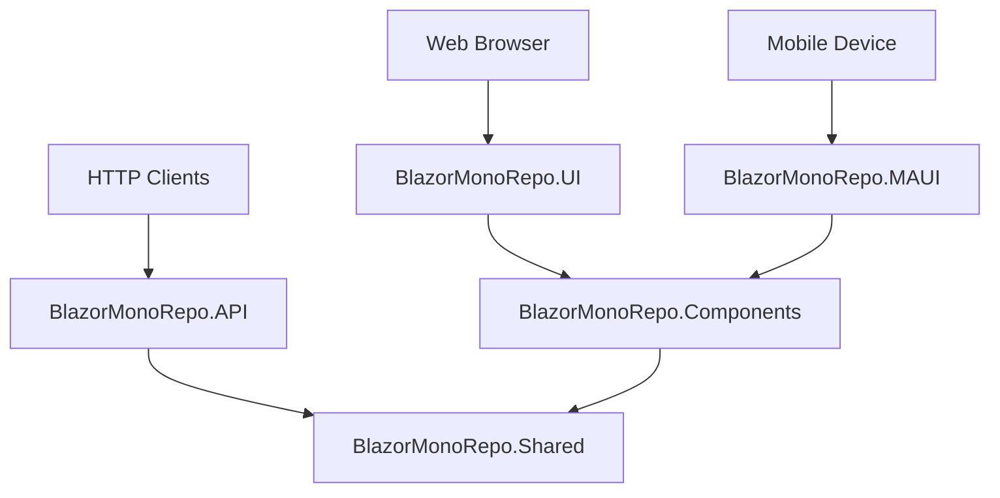

# Architecture Instructions

## Project Structure Deep Dive

### Core Projects

#### `BlazorMonoRepo.Shared`
**Purpose**: Foundation layer with models, interfaces, and utilities shared across all projects.

**Contents**:
- `Models/`: Data transfer objects, domain models
- `Services/`: Shared interfaces and utility classes
- Common enums, constants, and extensions

**Rules**:
- No UI dependencies
- No platform-specific code
- No external service dependencies (HTTP, file system, etc.)
- Pure .NET Standard compatible code

#### `BlazorMonoRepo.Components`
**Purpose**: Reusable Blazor UI components that work identically on web and mobile.

**Contents**:
- Shared Razor components (`.razor` files)
- Component-specific CSS (`.razor.css` files)
- JavaScript interop files (when needed for components)

**Rules**:
- Components must work on both web and mobile
- Use `[Parameter]` for all customization
- No direct service calls - accept data via parameters or inject abstractions
- Platform detection should be done through dependency injection, not hard-coded

#### `BlazorMonoRepo.UI`
**Purpose**: Web-specific Blazor Server application.

**Contents**:
- `Components/Pages/`: Web-specific pages that consume shared components
- `Services/`: Web-optimized service implementations (HTTP API calls)
- Web-specific configuration and middleware

**Rules**:
- Pages should primarily compose shared components
- Services should optimize for web scenarios (API calls, caching)
- Minimal direct business logic - delegate to shared components/services

#### `BlazorMonoRepo.MAUI`
**Purpose**: Mobile Blazor Hybrid application.

**Contents**:
- `Components/Pages/`: Mobile-specific pages that consume shared components
- `Services/`: Mobile-optimized service implementations (offline support, native features)
- Platform-specific configurations and resources

**Rules**:
- Pages should primarily compose shared components
- Services should optimize for mobile scenarios (offline-first, native APIs)
- Handle platform lifecycle events appropriately

#### `BlazorMonoRepo.API`
**Purpose**: RESTful API backend using minimal API pattern.

**Contents**:
- API endpoints in `Program.cs`
- API-specific middleware and configuration
- Data access logic (when added)

**Rules**:
- Follow REST conventions
- Return appropriate HTTP status codes
- Use minimal API pattern for simplicity
- Include Swagger documentation

### Dependency Flow



### Service Pattern

#### Interface Definition (Shared)
```csharp
// BlazorMonoRepo.Shared/Services/IWeatherService.cs
namespace BlazorMonoRepo.Shared.Services;

public interface IWeatherService
{
    Task<WeatherForecast[]> GetWeatherForecastAsync();
}
```

#### Web Implementation
```csharp
// BlazorMonoRepo.UI/Services/WeatherService.cs
public class WeatherService : IWeatherService
{
    private readonly HttpClient _httpClient;
    
    // Optimized for web: direct API calls
    public async Task<WeatherForecast[]> GetWeatherForecastAsync()
    {
        return await _httpClient.GetFromJsonAsync<WeatherForecast[]>("weatherforecast");
    }
}
```

#### Mobile Implementation
```csharp
// BlazorMonoRepo.MAUI/Services/MauiWeatherService.cs
public class MauiWeatherService : IWeatherService
{
    // Optimized for mobile: offline support, caching
    public async Task<WeatherForecast[]> GetWeatherForecastAsync()
    {
        // Try local cache first, fallback to API
    }
}
```

### Component Pattern

#### Shared Component
```csharp
// BlazorMonoRepo.Components/WeatherComponent.razor
@using BlazorMonoRepo.Shared.Models

<div class="weather-component">
    @if (Forecasts != null)
    {
        @foreach (var forecast in Forecasts)
        {
            <div class="forecast-item">
                <span>@forecast.Date.ToShortDateString()</span>
                <span>@forecast.TemperatureC°C</span>
                <span>@forecast.Summary</span>
            </div>
        }
    }
    else if (IsLoading)
    {
        <p>Loading weather data...</p>
    }
    else
    {
        <p>@ErrorMessage</p>
    }
</div>

@code {
    [Parameter] public WeatherForecast[]? Forecasts { get; set; }
    [Parameter] public bool IsLoading { get; set; }
    [Parameter] public string ErrorMessage { get; set; } = "Unable to load weather data.";
}
```

#### Platform Usage
```csharp
// Both UI and MAUI can use the same component
<WeatherComponent 
    Forecasts="@forecasts" 
    IsLoading="@isLoading" 
    ErrorMessage="@errorMessage" />
```

### Data Flow Principles

1. **Props Down, Events Up**: Components receive data via parameters, emit events for actions
2. **Service Abstraction**: Components don't know about HTTP, they work with service abstractions
3. **Platform Optimization**: Services are optimized per platform, components are platform-agnostic
4. **Error Boundaries**: Handle errors gracefully at the service level and surface them to components

### Testing Strategy

- **Unit Tests**: Test shared services and utilities
- **Component Tests**: Test shared components in isolation
- **Integration Tests**: Test API endpoints
- **Platform Tests**: Test platform-specific services and features
